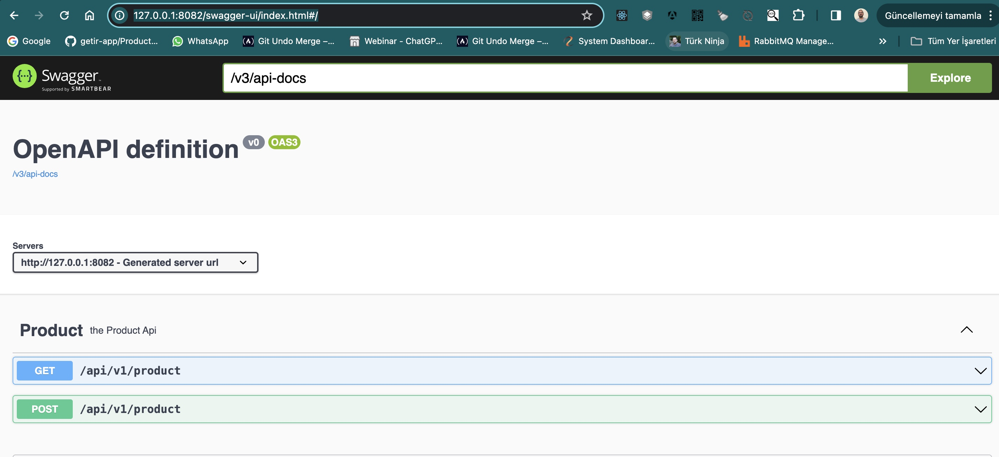
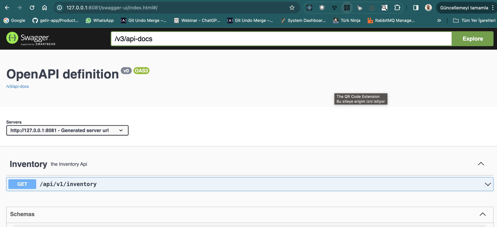
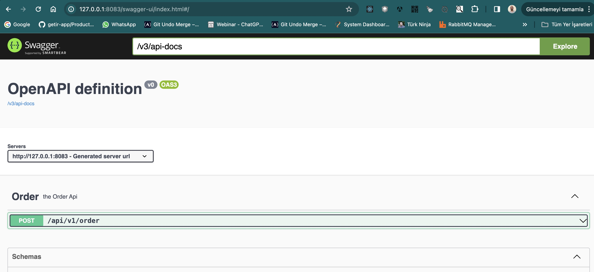

<h2>Inventory Management Microservices</h2>
1. Inventory Service manage each inventory on product and its capacity.
2. Order Service manage all the orders to inventory.
3. Product Service manage adding new products.
Microservices
Discovery Server
API Gateway

<h3>Tools</h3>

Java

Spring Boot

Spring Cloud

Spring Data JPA

Eureka Discovery Server

PostgreSQL

<h3>Run the Services:</h3>
<h4>Start the API Gateway.</h4>
<h4>Start the Discovery Service.</h4>
<h4>Start the Product Service.</h4>
<h4>Start the Inventory Service.<h4>
<h4>Start the Order Service.</h4>

<h2>Endpoints:</h2>

Product Service

http://127.0.0.1:8082/swagger-ui/index.html#/

Inventory Service

http://127.0.0.1:8081/swagger-ui/index.html#/

Order Service

http://127.0.0.1:8083/swagger-ui/index.html#/

